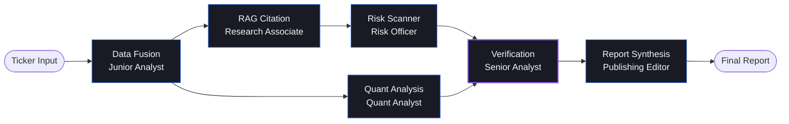

# AlphaLens — AI Equity Research in 90 Seconds

> **One engineer. Six AI agents. Zero cost. Full research desk.**

AlphaLens compresses 8+ hours of professional equity research into ~90 seconds using a LangGraph multi-agent pipeline powered by Google Gemini 2.0 Flash. Each agent maps to a real analyst role on a traditional research team — replacing the entire team with a state machine.

Built as a Northeastern MS Generative AI capstone. Demonstrates RAG, prompt engineering, multi-agent orchestration, multimodal data fusion, and evaluation metrics.

**[🌐 Web Page](https://rishisehgal.github.io/AlphaLens/)** · **[🚀 Live App](https://rishisehgal-alphalens.streamlit.app/)** · **[▶ Watch the 10-Minute Demo on Loom](https://www.loom.com/share/36213fda55af4fd2829f19d726ef1957)**

---

## Architecture



---

## Agent-to-Analyst Mapping

| Agent | Traditional Role | Responsibility |
|-------|-----------------|----------------|
| **Data Fusion** | Junior Analyst | Parallel API calls to SEC EDGAR, Alpha Vantage, FRED, yfinance. Normalises raw data. |
| **RAG Citation** | Research Associate | Downloads 10-K, parses sections, chunks + embeds via Gemini, stores in ChromaDB, retrieves top-k. |
| **Quant Analysis** | Quantitative Analyst | 3-stage DCF (bear/base/bull), RSI(14), MACD(12/26/9), earnings surprise vs consensus. |
| **Risk Scanner** | Risk & Compliance Officer | Two-stage: keyword pattern match → Gemini LLM confirmation. 9 risk categories. |
| **Verification** | Senior Analyst (Crown Jewel) | Cross-references narrative claims vs quantitative data. Flags divergences with evidence. |
| **Report Synthesis** | Publishing Editor | Assembles 5 structured sections with citations, confidence scores, and disclaimer. |

---

## Tech Stack

| Layer | Technology | Why |
|-------|-----------|-----|
| Orchestration | LangGraph 0.2+ | Parallel fan-out, fan-in, typed state |
| LLM | Gemini 2.0 Flash | Free tier: 15 RPM, 1M tokens/day |
| Embeddings | gemini-embedding-001 | 3072-dim, free via google-genai SDK |
| Vector DB | ChromaDB (local) | Zero cost, cosine similarity, persistent |
| Frontend | Streamlit + custom HTML/CSS | Dark financial-SaaS look, no default styling |
| Charts | Plotly | Interactive dark-theme charts |
| Market Data | yfinance + Alpha Vantage | Free; AV for structured statements, yf for prices |
| Filings | SEC EDGAR (no key) | 10 req/sec, public domain |
| Macro | FRED API | Federal Reserve public data |
| Language | Python 3.11+ | Type-annotated throughout |

---

## Setup

### Prerequisites

- Python 3.11+
- Google API key (free at [aistudio.google.com](https://aistudio.google.com))
- Alpha Vantage key (free at [alphavantage.co](https://www.alphavantage.co))
- FRED key (free at [fred.stlouisfed.org](https://fred.stlouisfed.org))

### Installation

```bash
git clone https://github.com/RishiSehgal/AlphaLens.git
cd alphalens

python -m venv .venv
source .venv/bin/activate      # Windows: .venv\Scripts\activate

pip install -r requirements.txt
```

### Configuration

```bash
cp .env.example .env
# Edit .env with your API keys:
```

```env
GOOGLE_API_KEY=your_gemini_key
ALPHA_VANTAGE_API_KEY=your_av_key
FRED_API_KEY=your_fred_key
```

### Run

```bash
streamlit run app.py
```

Open [http://localhost:8501](http://localhost:8501), enter a ticker (e.g. `NVDA`), and click **Analyze**.

### Command-line pipeline

```bash
python -m src.graph AAPL
```

---

## Usage Guide

1. **Enter a ticker** in the search box (e.g. `AAPL`, `NVDA`, `MSFT`)
2. **Click Analyze** — the 6 agents run sequentially/in-parallel with live progress indicators
3. **Review the report** — Executive Summary → Financial Health → Valuation → Risk Flags → Verification Verdict
4. **Explore charts** — DCF sensitivity heatmap, RSI gauge, Price+MACD, Earnings comparison
5. **Ask follow-up questions** — the chat widget is grounded in the generated analysis
6. **Check the sidebar** — generation time, data sources, confidence bars, agent latencies

### Graceful Degradation

| Failure | Behavior |
|---------|----------|
| Alpha Vantage rate limit | Falls back to yfinance; confidence adjusted |
| EDGAR filing not found | Skips RAG; market-data-only report |
| Gemini 429 quota | 65-second exponential backoff; retries up to 4× |
| Any agent crash | Pipeline continues; section marked "unavailable" |

---

## Evaluation Results

Evaluated on golden test set: **AAPL, NVDA, MSFT** (FY2024 public data)

| Metric | Target | AAPL | NVDA | MSFT |
|--------|--------|------|------|------|
| Retrieval Precision@5 | ≥ 0.60 | — | — | — |
| Retrieval Recall@5 | ≥ 0.80 | — | — | — |
| Faithfulness | ≥ 0.90 | — | — | — |
| Numerical Accuracy | ≥ 0.95 | — | — | — |
| Earnings Surprise Acc. | 1.00 | — | — | — |

> Run `python -m src.eval.runner` to populate the table with live results.
> Full results saved to [docs/eval_results.md](docs/eval_results.md).

---

## Cost Analysis

**Total cost to run AlphaLens: $0.00** (free tier)

| Resource | Limit | AlphaLens Usage |
|---------|-------|----------------|
| Gemini 2.0 Flash | 15 RPM, 1M tok/day | ~6 calls/run, ~8K tokens |
| SEC EDGAR | 10 req/sec | ~2 req/run |
| Alpha Vantage | 25 req/day | ~3 req/run |
| FRED API | Unlimited | ~4 req/run |
| yfinance | Courtesy limits | ~3 req/run |
| ChromaDB | Local storage | ~0 MB/ticker |

If Gemini free tier is exceeded (> 1M tokens/day):
- Gemini 2.0 Flash input: $0.10 / 1M tokens
- Gemini 2.0 Flash output: $0.40 / 1M tokens
- Estimated cost at paid tier: **< $0.01 per analysis**

---

## Ethics & Disclaimer

**AlphaLens is NOT financial advice.**

- All analysis is AI-generated and may contain errors
- Confidence scores explicitly communicate uncertainty
- DCF models are capped at MEDIUM confidence by design
- All data sourced from public domain / free-tier APIs
- No user data collected or stored
- Do not make investment decisions based solely on this output

---

## Project Structure

```
AlphaLens/
├── app.py                    # Streamlit entry point
├── src/
│   ├── config.py             # API keys, model constants, color system
│   ├── state.py              # LangGraph TypedDict with parallel-safe reducers
│   ├── graph.py              # LangGraph StateGraph: compile, run, stream
│   ├── agents/               # 6 agent implementations
│   │   ├── data_fusion.py
│   │   ├── rag_citation.py
│   │   ├── quant_analysis.py
│   │   ├── risk_scanner.py
│   │   ├── verification.py
│   │   └── report_synthesis.py
│   ├── data/                 # API clients
│   │   ├── edgar_client.py
│   │   ├── market_data.py
│   │   ├── fred_client.py
│   │   └── filing_parser.py
│   ├── rag/                  # Embedding + retrieval
│   │   ├── chunker.py
│   │   ├── embeddings.py
│   │   └── retriever.py
│   ├── eval/                 # Evaluation suite
│   │   ├── test_cases.py     # Golden data: AAPL, NVDA, MSFT
│   │   ├── metrics.py        # Precision@k, Recall@k, Faithfulness, etc.
│   │   └── runner.py         # CLI runner → docs/eval_results.md
│   ├── utils/
│   │   ├── cost_tracker.py
│   │   ├── cache.py          # 24h TTL state cache
│   │   ├── rate_limiter.py   # Token bucket per API
│   │   └── error_handler.py  # Graceful degradation wrappers
│   └── ui/
│       ├── components.py     # 9 custom HTML/CSS components
│       ├── charts.py         # 4 Plotly dark-theme charts
│       ├── report_view.py
│       ├── sidebar.py
│       └── chat.py           # Gemini-grounded follow-up Q&A
├── tests/
│   ├── test_data_fusion.py
│   ├── test_rag.py
│   ├── test_verification.py
│   └── test_eval.py
├── docs/
│   ├── architecture.md
│   └── eval_results.md
├── examples/
│   └── sample_output_NVDA.json
└── web/
    └── index.html            # GitHub Pages showcase
```

---

## Future Roadmap

- [ ] Options flow analysis (unusual activity scanner)
- [ ] Multi-ticker comparison mode
- [ ] PDF report export
- [ ] Historical analysis (backtest against past filings)
- [ ] Streaming token display during LLM generation
- [ ] Institutional ownership data (SEC Form 13F)
- [ ] Earnings call transcript analysis
- [ ] Competitor positioning matrix

---

## License

MIT License — see [LICENSE](LICENSE) for details.

Built with ❤️ by [Rishi Sehgal](mailto:sehgal.r@northeastern.edu) · Northeastern University MS AI 2026
